# AI Tester Blueprint 3.x

A practical, project-driven curriculum for QA engineers learning to use LLMs as a real testing tool — not a toy.
Each chapter pairs concept material with a hands-on project, a prompt template, and runnable code where applicable.

- **Author:** Pramod Dutta — Principal SDET
- **Website:** [The Testing Academy](https://thetestingacademy.com/)
- **LinkedIn:** [linkedin.com/in/pramoddutta](https://www.linkedin.com/in/pramoddutta/)

---

## Curriculum Map

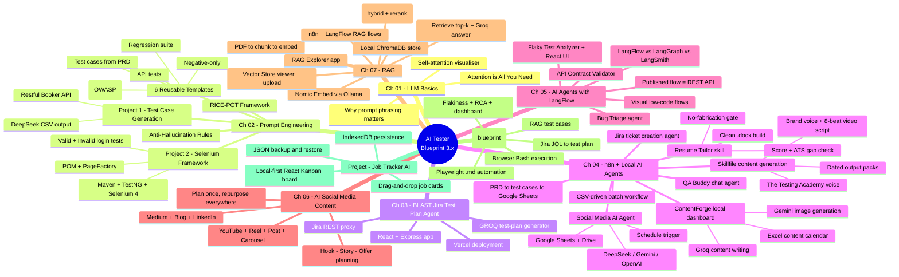

---

## Repository Layout

```
.
├── chapter_01_LLM_Basics/         How transformers and attention work
│   ├── attention_interactive.html
│   ├── attention_is_all_you_need.html
│   └── Notes.md
│
├── chapter_02_Prompt_Eng/         Prompt engineering for QA work
│   ├── Anti_Hallucinations_Rules.md
│   ├── Project1_TC_Gen/           Test case generation from a PRD/API doc
│   │   ├── RICE-POT-TestCase-Prompt.md
│   │   ├── RICE_POT_FRAMEWORK/
│   │   ├── Restful-booker.pdf
│   │   ├── Restful_Booker_API_Test_Cases.md
│   │   └── output/
│   ├── Project2_Selenium_Framework/   POM-based Selenium framework built from a prompt
│   │   ├── Problem.md
│   │   ├── SKILL.md                   RICE-POT prompt-builder skill
│   │   ├── blank-template-rice-pot.md
│   │   └── AdvanceSeleniumFramework/  Maven + TestNG + Selenium 4
│   └── templates/                 Reusable prompt templates (RTCFR / RICE-POT)
│       ├── 01_TestCaseGeneration_Prompt.md
│       ├── 02_TestCases_from_prd
│       ├── 03_API_Test_Generation.md
│       ├── 04_Negative_TC_Only.md
│       ├── 05_Secuirty_Test.md
│       └── 06_Regression_Suite.md
│
├── chapter_03_BLAST_FW_JIRA_AI_AGENT/   Jira to test-plan generator
│   ├── README.md
│   ├── B.L.A.S.T.md
│   ├── architecture/              Layer 1 SOPs and test-plan template
│   ├── api/                       Vercel serverless endpoints
│   ├── src/                       React UI
│   ├── tools/                     Jira, GROQ, and Markdown engines
│   ├── server.js                  Local Express proxy
│   └── package.json
│
├── chapter_04_AI_Agents_n8n/      n8n workflows + local AI agent projects
│   ├── README.md
│   ├── n8n_AIAgent/
│   │   ├── AI_3X_01_QA_Buddy.json
│   │   ├── AI_3X_02_JIRA_Agent.json
│   │   ├── AI_3X_03_Read_PRD_TestCases_Excel.json
│   │   ├── AI_3X_04_Read_PRD_TestCases_Excel_v2.json
│   │   └── AI_3X_05_Social_media_AI agent.json   Scheduled social-post agent
│   ├── social_ai_agent/
│   │   └── contentforge/          Next.js local content pipeline dashboard
│   ├── resume-tailor/             Resume scoring + ATS tailoring skill
│   │   ├── SKILL.md
│   │   ├── references/            ATS analysis, docx build, input reading
│   │   └── scripts/build_resume.js
│   └── skillfile_content_generation/
│       ├── SKILL.md               The Testing Academy content engine
│       ├── brand-voice.md         Brand voice + 8-beat video script guide
│       └── output/                Dated publish-ready content packs
│
├── chapter_05_AI_Agents_LangFlow/ Visual low-code AI agents (LangFlow)
│   ├── README.md
│   ├── LangFlow vs LangGraph vs LangSmith.md
│   ├── Project/
│   │   ├── AI3X_001_HelloWorld.json
│   │   ├── AI3X_002_Flaky_Test_AIAgent.json
│   │   ├── AI3X_003_Bug_Triage_AI_Agent.json
│   │   └── AI3X_004_API_Contract_Validator.md
│   └── flaky_test_analyzer_ai_Agent/
│       ├── PROMPTS.md             Agent prompt + UI build prompt (shareable)
│       ├── result1.json / result2.json   Sample Playwright runs
│       └── ui/                    React UI proxied to the LangFlow API
│
├── chapter_06_AI_Social_Media_Content_Creation/   One idea to a full content pack
│   ├── README.md
│   ├── 00_Hook_Story_Offer_Planning.md    Plan any idea before writing
│   ├── 01_YouTube_Video_Template.md
│   ├── 02_Instagram_Reel_Template.md
│   ├── 03_Instagram_Post_Template.md
│   ├── 04_Instagram_Carousel_Template.md
│   ├── 05_Medium_Article_Template.md
│   ├── 06_Blog_Post_Template.md
│   └── 07_LinkedIn_Post_Template.md
│
├── chapter_07_RAG/                Retrieval-Augmented Generation
│   ├── RAG_Explorer.jpg
│   ├── BASIC_RAG_N8N.jpg
│   ├── Basic_RAG/
│   │   ├── data/                  Source PDF (VWO PRD)
│   │   └── rag-explorer/          React + Express RAG demo app
│   │       ├── server/            Express API: pdf, chunk, embed, chroma, groq
│   │       ├── src/               React UI (pipeline view, ingest, query)
│   │       └── README.md
│   ├── n8n_BASIC_RAG/             No-code Basic RAG (n8n workflow)
│   │   └── AI3X_Basic_RAG.json
│   ├── LangFlow_RAG/              Visual RAG flows (Naive + improved chunking)
│   │   ├── AI_3X_Naive RAG.json
│   │   ├── AI_3X_Naive RAG_Imporve_Chunk.json
│   │   └── data/                  VWO_500_Test_Cases.csv
│   └── Advance_RAG/               Hybrid RAG app (bge-m3 + Qdrant + rerank)
│       ├── app.py, rag_core.py, ingest.py
│       ├── testcase/              5,000 VWO test cases (Jira CSV)
│       ├── templates/, static/    Two-pane Flask UI
│       └── Advanced_RAG_Explained.html   Standalone animated explainer
│
├── E2E_QA_Pipeline/               End-to-end AI QA pipeline blueprint
│   └── E2E_QA_Pipeline.md         8-step flow: Jira -> plan -> cases -> automation -> run -> RCA
│
└── Project_Job_TRACKERAI/         Local-first job application tracker
    ├── README.md
    ├── package.json
    ├── src/
    │   ├── App.jsx
    │   ├── constants.js
    │   └── db.js
    └── public/
        └── favicon.svg
```

---

## Chapter 01 — LLM Basics

Foundational material on how Large Language Models read text and decide what to output. The key idea: a model is not a database lookup — it weighs every token against every other token (attention) and predicts the next one.

**What's here:**
- `attention_is_all_you_need.html` — interactive walkthrough of the original Transformer paper concepts.
- `attention_interactive.html` — visualises self-attention so you can see why prompt phrasing changes outputs.
- `Notes.md` — short recap notes.

**Why a QA engineer should care:** the model's behaviour is deterministic-ish on a per-token level, but every word you add to a prompt shifts the attention weights. That is why structured prompt frameworks (next chapter) outperform free-form questions.

**Q&A — why this matters for testing:**
- **Q: Why does the same prompt give different test cases each run?** A: Sampling temperature plus floating-point non-determinism in attention. Pin `temperature=0` and set explicit constraints to flatten variance.
- **Q: Why does adding "be thorough" rarely help?** A: Vague tokens add weight without direction. Replace with measurable constraints — "cover boundary, negative, and security cases" steers attention to specific output shape.
- **Q: Do I need to read the original Transformer paper?** A: No — but understanding that the model weighs every token against every other token explains why irrelevant words in your prompt pollute the answer.

**Mental model — how one prompt token influences the output:**

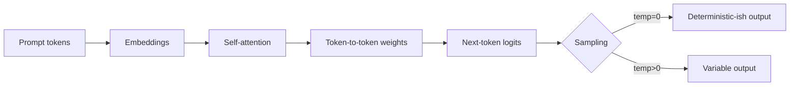

**Quick demo — try it locally:**

```bash
# clone, then just open the HTML files in a browser - no build, no install
open chapter_01_LLM_Basics/attention_interactive.html
open chapter_01_LLM_Basics/attention_is_all_you_need.html
```

Hover over tokens in `attention_interactive.html` to see the live attention matrix. Edit the input sentence to see weights shift in real time — that's the same mechanism that makes your prompt wording matter.

---

## Chapter 02 — Prompt Engineering for QA

This chapter turns prompt engineering into a repeatable QA skill. Three pillars:

1. **Anti-hallucination rules** — guardrails so the model only uses provided input.
2. **RICE-POT framework** — a structured prompt template (Role, Instructions, Context, Example, Parameters, Output, Tone).
3. **Two projects + six templates** — applied on real artifacts (a PRD-style API doc and a Selenium framework build).

**Q&A — RICE-POT vs free-form prompting:**
- **Q: I already get OK results from "write test cases for this PRD." Why bother with a framework?** A: "OK" is the ceiling. RICE-POT forces you to declare the persona, format, and constraints, which is what turns a 60% useful answer into a 95% useful one — every time, not just on lucky runs.
- **Q: Isn't this just over-engineering a chat message?** A: For one-offs, yes. For repeatable QA tasks (regression suites, security checklists, daily test-case generation), the template pays for itself within three uses.
- **Q: Which letter is most often skipped — and what breaks?** A: `P` (Parameters). Without the anti-hallucination block, the model invents fields, IDs, and error codes that don't exist in your PRD. Output looks plausible but ships bugs.

**RICE-POT prompt flow — from goal to copy-pasteable prompt:**

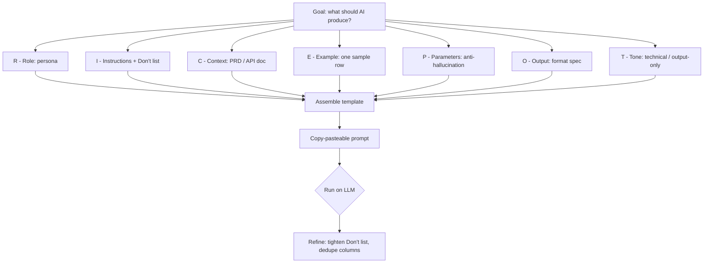

### Anti-Hallucination Rules (`Anti_Hallucinations_Rules.md`)

A drop-in `ROLE` block you prepend to any QA prompt. Forces the model to:
- Use only the inputs you provide (PRD, screenshots, API docs).
- Refuse to assume "typical" system behaviour.
- Output exactly `"Insufficient information to determine."` when an input is missing.
- Label inferred details as `"Inference (low confidence)"`.
- Produce a Verified Facts / Missing Info / Output / Self-Validation block.

Use this on every factual-generation prompt in this repo.

### Project 1 — Test Case Generation with RICE-POT

Goal: turn an API PDF (`Restful-booker.pdf`) into a CSV of enterprise-grade test cases.

- `RICE-POT-TestCase-Prompt.md` — the worked prompt. Targets `app.vwo.com` as the example product, but the structure transfers to any PRD/API doc.
- `RICE_POT_FRAMEWORK/RICE_POT.md` — explanation of each letter of the framework.
- `Restful-booker.pdf` + `Restful_Booker_API_Test_Cases.md` — input PDF and the generated test-case set.
- `output/deepseek_csv_20260524_0d9b7c.csv` — actual model output produced from the prompt.

**Q&A — Project 1 design choices:**
- **Q: Why a PDF input and not just pasted text?** A: PDFs mirror how QA actually receives PRDs and API specs. Forcing the model to extract from the document tests whether the prompt's anti-hallucination block holds under realistic input noise.
- **Q: Why CSV output instead of Markdown?** A: CSV imports cleanly into Jira, TestRail, qTest, and Zephyr. The model is told the exact column order so the file drops straight into a test-management tool.
- **Q: How do I trust the output?** A: Cross-check the `Traceability` column — every test case row must cite a section of the source PDF. Rows without traceability fail review.

**Sample output row (from `deepseek_csv_20260524_0d9b7c.csv`):**

```csv
TC_ID,Title,Preconditions,Steps,Test Data,Expected Result,Type,Priority,Traceability
TC_API_007,Create booking with valid payload,"Auth token obtained","POST /booking with required fields","firstname=Jim, lastname=Brown, totalprice=111, depositpaid=true","HTTP 200 + bookingid + booking object echoed back",Positive,High,"Restful-booker.pdf §Booking → CreateBooking"
```

**How to exercise it:**
1. Open `RICE-POT-TestCase-Prompt.md` in any AI tool (ChatGPT, Claude, Gemini, DeepSeek).
2. Attach `Restful-booker.pdf` (or your own PRD).
3. Confirm the output is CSV only, columns match the spec, and every test case traces back to the PDF.

### Project 2 — Selenium Framework from a Prompt

Goal: prove RICE-POT can build production code, not just test cases.

- `Problem.md` — the brief: "generate a Selenium framework from scratch with two page objects, production ready."
- `SKILL.md` — the RICE-POT prompt-builder skill definition. Tells the AI how to interview you, assemble the prompt, and deliver it copy-pasteable.
- `blank-template-rice-pot.md` — fill-in template with the recommended anti-hallucination Parameters block.
- `AdvanceSeleniumFramework/` — the actual output the framework generates:
  - Maven project, Java 11, Selenium 4.25, TestNG 7.10.
  - `LoginPage.java` — PageFactory POM with explicit waits, fluent API, no Thread.sleep.
  - `BaseTest.java` — driver lifecycle.
  - `ConfigReader.java` — `config.properties` loader.
  - `ValidLoginTest.java` / `InvalidLoginTest.java` — positive + negative TestNG cases.
  - `testng.xml` / `testng-smoke.xml` — full and smoke suites.

**Q&A — Project 2 design choices:**
- **Q: Why XPath only?** A: The prompt locked it to one locator strategy on purpose — consistency makes generated code reviewable. In production you'd mix CSS + XPath, but the discipline of "one strategy" is what the prompt enforces.
- **Q: Where do real credentials go?** A: `src/main/resources/config.properties`. Placeholders `REPLACE_WITH_...` fail fast in `@BeforeTest` so a forgotten config never silently passes a test.
- **Q: Why headless Chrome by default?** A: macOS 26.1 + Chrome 148 dropped windowed sessions mid-test in this repo. Headless avoids the focus/sandbox issue and is what CI uses anyway.

**Framework architecture — what the prompt generated:**

```mermaid
flowchart TD
    CFG[config.properties] --> CR[ConfigReader]
    CR --> BT[BaseTest]
    BT -->|@BeforeMethod| D[ChromeDriver headless]
    BT -->|@AfterMethod| Q[driver.quit]
    LP[LoginPage - POM + PageFactory] --> XP["@FindBy xpath only"]
    VT[ValidLoginTest] --> LP
    IT[InvalidLoginTest + @DataProvider] --> LP
    VT -.extends.-> BT
    IT -.extends.-> BT
    SUITE[testng.xml] --> VT
    SUITE --> IT
    SMOKE[testng-smoke.xml] --> IT
```

**LoginPage snippet (XPath + explicit waits, no Thread.sleep):**

```java
public class LoginPage {
    @FindBy(xpath = "//input[@id='username']") private WebElement usernameField;
    @FindBy(xpath = "//input[@id='password']") private WebElement passwordField;
    @FindBy(xpath = "//input[@id='Login']")    private WebElement loginButton;
    @FindBy(xpath = "//div[@id='error']")      private WebElement errorMessage;

    public LoginPage(WebDriver driver) {
        this.wait = new WebDriverWait(driver,
            Duration.ofSeconds(ConfigReader.getInt("timeout.explicit")));
        PageFactory.initElements(driver, this);
    }

    public void loginAs(String user, String pass) {
        wait.until(ExpectedConditions.visibilityOf(usernameField)).sendKeys(user);
        passwordField.sendKeys(pass);
        wait.until(ExpectedConditions.elementToBeClickable(loginButton)).click();
    }
}
```

**Run it:**
```bash
cd chapter_02_Prompt_Eng/Project2_Selenium_Framework/AdvanceSeleniumFramework
mvn -q clean test-compile
mvn test                       # full suite
mvn test -DsuiteXmlFile=testng-smoke.xml   # smoke only
```

### Templates — RTCFR + RICE-POT (`templates/`)

Six copy-paste prompt templates for the most common QA tasks. Each follows the **RTCFR** shape — Role, Task, Constraints, Format, Requirements — which is the lightweight cousin of RICE-POT.

| # | File | Purpose |
|---|------|---------|
| 01 | `01_TestCaseGeneration_Prompt.md` | Basic test-case generation from free-form requirements. |
| 02 | `02_TestCases_from_prd` | Comprehensive PRD → test cases (functional, negative, boundary, edge). |
| 03 | `03_API_Test_Generation.md` | API endpoint test cases from API docs. |
| 04 | `04_Negative_TC_Only.md` | Negative-only suite — invalid inputs, auth violations, malformed data. |
| 05 | `05_Secuirty_Test.md` | OWASP-top-10-aligned security test cases. |
| 06 | `06_Regression_Suite.md` | Regression suite for a module with execution-time estimates. |

**Use any template:**
1. Open the file and copy the fenced block.
2. Replace `[FEATURE]` / `[PASTE REQUIREMENTS]` / `[PASTE PRD]` etc. with your input.
3. Paste into your AI tool. Keep the `CONSTRAINTS` block intact — that's what stops hallucination.

---

## Chapter 03 — B.L.A.S.T. Jira Test Plan Generator

This chapter turns a Jira ticket into a formal QA test plan through a lightweight **React + Express** app. It uses the **B.L.A.S.T.** protocol (Blueprint, Link, Architect, Stylize, Trigger) and an **A.N.T.** 3-layer architecture.

**What's here:**
- `README.md` — setup, local run, production run, and Vercel deployment notes.
- `src/` — React UI for Settings, Generate, and Test Plan views.
- `server.js` + `tools/` — local Express proxy, Jira fetcher, GROQ client, and deterministic Markdown renderer.
- `api/` + `vercel.json` — serverless production deployment path.
- `architecture/` — SOPs for Jira fetch, GROQ generation, and the 13-section test-plan template.

**Why a QA engineer should care:** Jira tickets are often the real source of truth. This project shows how to keep credentials out of the browser, fetch ticket context safely, ask an LLM for structured JSON, and render a repeatable test plan without relying on free-form chat output.

**Run it locally:**
```bash
cd chapter_03_BLAST_FW_JIRA_AI_AGENT
npm install
npm run dev
```

Open `http://localhost:5173`, add Jira + GROQ credentials in the Settings tab, then generate a plan from a Jira ID.

---

## Chapter 04 — n8n and Local AI Agents for QA

This chapter adds importable **n8n** workflows and local AI-agent projects for practical QA and content automation. It shows how to connect chat triggers, LLM nodes, Jira tools, Google Sheets output, Slack/Teams triggers, CSV-driven batch processing, a local Next.js dashboard, local Excel persistence, and content-generation skill files.

**What's here:**
- `AI_3X_01_QA_Buddy.json` — chat-triggered QA assistant using a GROQ-backed LLM node.
- `AI_3X_02_JIRA_Agent.json` — chat agent that can create Jira tickets.
- `AI_3X_03_Read_PRD_TestCases_Excel.json` — fetches PRD/ticket context and writes generated test cases into Google Sheets.
- `AI_3X_04_Read_PRD_TestCases_Excel_v2.json` — extends the PRD-to-test-cases flow with CSV upload and batch Jira processing.
- `social_ai_agent/contentforge/` — local Next.js + TypeScript dashboard for a daily content-generation pipeline.
- `skillfile_content_generation/SKILL.md` — content engine skill for The Testing Academy publish-ready content packs.
- `skillfile_content_generation/output/2026-06-14/` — generated content pack for "Your AI Agent Needs a QA Contract, Not More Prompts."

**How to use the n8n workflows:**
1. Open n8n Cloud or a self-hosted n8n instance.
2. Import the JSON workflow from `chapter_04_AI_Agents_n8n/n8n_AIAgent/`.
3. Reconnect credentials for the nodes you use: GROQ, DeepSeek, Jira, Google Sheets, Slack, or Microsoft Teams.
4. Run the chat trigger, form trigger, schedule trigger, or team-channel trigger depending on the workflow.

**Run ContentForge locally:**
```bash
cd chapter_04_AI_Agents_n8n/social_ai_agent/contentforge
npm install
cp .env.example .env.local
npm run dev
```

Add your local keys to `.env.local` or `.env`:

```bash
GROQ_API_KEY=...
GEMINI_API_KEY=...
```

ContentForge keeps generated data local:

- `content_calendar.xlsx` in the app root.
- Generated runtime images under `public/images/`.
- API keys in `.env.local` or `.env`.

Those local files are ignored and should not be committed.

**Use the content skill output:**

Open `chapter_04_AI_Agents_n8n/skillfile_content_generation/output/2026-06-14/` for separate Markdown files covering the topic, LinkedIn post, Medium article, YouTube script, Instagram carousel copy, and image prompts.

### Social Media AI Agent (`n8n_AIAgent/AI_3X_05_Social_media_AI agent.json`)

**Concept:** A scheduled n8n agent that wakes on a timer, asks an LLM agent node to draft social posts, parses them into a fixed structure, and writes the result to Google Sheets and Google Drive — fully unattended.

**Why:** Manual daily posting does not scale. This workflow turns "post every day" into a cron-driven pipeline that produces consistent, on-brand content while you sleep.

**Q&A — running an autonomous content agent:**
- **Q: Why three model nodes (DeepSeek, Gemini, OpenAI)?** A: They are swappable backends on the same agent — pick the one with the best price/quality for your account, or fall back when one rate-limits.
- **Q: Why a structured output parser?** A: Free-form text breaks the Sheets/Drive write. The parser forces the agent into a typed shape (e.g. platform, caption, hashtags) so downstream nodes get clean columns.
- **Q: Where do drafts land?** A: Rows in Google Sheets for review and assets in Google Drive — so a human approves before anything publishes.

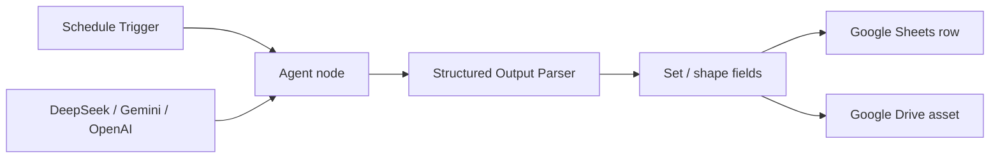

**Import + run:**
1. Import `AI_3X_05_Social_media_AI agent.json` into n8n.
2. Reconnect credentials for one chat model (DeepSeek / Gemini / OpenAI), Google Sheets, and Google Drive.
3. Set the Schedule Trigger cadence, then activate the workflow.

### Resume Tailor Skill (`resume-tailor/`)

**Concept:** A reusable skill that scores a resume, runs an ATS keyword gap analysis against a target job description, and rebuilds a clean, ATS-parseable `.docx` — without ever inventing experience.

**Why:** Generic resumes get filtered out by ATS keyword matching; fabricated ones get the candidate caught in the interview. This skill tailors honestly: it only adds skills the candidate confirms they actually have.

**Q&A — tailoring without lying:**
- **Q: What stops it from stuffing keywords?** A: A hard confirmation gate (Phase 3). Any skill not already evidenced on the resume is held back until the candidate explicitly confirms they have it.
- **Q: What does it output?** A: A 6-point scored review, an ATS table with a match %, and a rebuilt single-column `.docx` (`scripts/build_resume.js`) with no leftover `[ ]` placeholders.
- **Q: Can I re-run it for a new JD?** A: Yes — it rebuilds incrementally and re-confirms only what is newly uncertain.

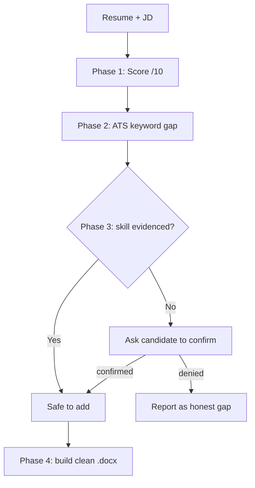

Read `resume-tailor/SKILL.md` for the full 4-phase workflow and the no-fabrication rule.

### Brand Voice + Video Script Guide (`skillfile_content_generation/brand-voice.md`)

**Concept:** A reverse-engineered brand-voice template plus an 8-beat YouTube video skeleton — a repeatable structure for scripting videos that hook, teach, and convert.

**Why:** Consistency is what makes a channel recognisable. This guide encodes the tone (plain-spoken practitioner, honest trade-offs, household analogies) and a beat-by-beat structure so every script follows the same proven shape.

**Q&A — using the voice guide:**
- **Q: What are the 8 beats?** A: Personal Hook → Promise/Roadmap → Why Now → Plain-English Definition → Practical How-To → Payoff/Ideas → Reframe/Lesson → Empowering CTA.
- **Q: What is the one-line voice summary?** A: "Talk like a smart friend who's figuring it out in real time — dead-simple ideas, household analogies, honest pros and cons, numbered steps, and a send-off that leaves people feeling capable."
- **Q: How do I use it?** A: Feed it to a content skill or LLM as the style contract, then check your draft against the Part 3 scripting checklist before recording.

---

## Chapter 05 — AI Agents with LangFlow

LangFlow is a **visual, low-code builder** for LLM apps and AI agents. You wire components (models, prompts, tools, file loaders, parsers) on a canvas, test the flow live, then publish it as an HTTP API — every flow gets `POST /api/v1/run/{flowId}`, so any front-end or CI job can call it.

This chapter builds real QA agents on top of that API and contrasts LangFlow with LangGraph and LangSmith (`LangFlow vs LangGraph vs LangSmith.md`).

**What's here:**
- `Project/AI3X_001_HelloWorld.json` — the minimal "first flow" to confirm the canvas and API work.
- `Project/AI3X_002_Flaky_Test_AIAgent.json` — the Flaky Test Analyzer flow.
- `Project/AI3X_003_Bug_Triage_AI_Agent.json` — a bug-triage flow (API Request → Prompt → OpenRouter → Parser → Chat output).
- `Project/AI3X_004_API_Contract_Validator.md` — the GET request + JSON Schema spec the validator flow runs on.
- `flaky_test_analyzer_ai_Agent/ui/` — a React UI that drives the Flaky Test Analyzer through a Vite proxy.

**Why a QA engineer should care:** LangFlow turns an agent into a callable endpoint without backend boilerplate. The same flow you prototype on the canvas becomes the API your test harness, CI pipeline, or internal tool calls — no rewrite.

**Q&A — LangFlow for QA agents:**
- **Q: Why proxy the UI through Vite instead of calling LangFlow directly?** A: LangFlow's file-upload endpoint does not answer the browser's CORS preflight, so a direct cross-origin upload fails with *"Failed to fetch."* Routing through Vite makes every request same-origin.
- **Q: How does a file actually reach the flow?** A: Two calls — upload each file to `POST /api/v1/files/upload/{flowId}` to get a server `file_path`, then run the flow with those paths injected as `tweaks` on the flow's File components.
- **Q: LangFlow vs LangGraph vs LangSmith?** A: LangFlow = visual flow builder + API; LangGraph = code-first stateful agent graphs; LangSmith = tracing/eval/observability. They compose; they don't compete.

**How a published flow is called:**

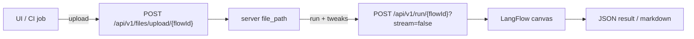

### Flaky Test Analyzer (`AI3X_002` + `ui/`)

**Concept:** A LangFlow agent that ingests two Playwright `results.json` files (baseline vs. candidate build) and reports which build is flakier — separating genuine flaky tests from consistent failures, with rerun / send-to-engineering recommendations. A React UI renders the diagnosis as markdown.

**Why:** "Re-run until green" hides real regressions. This agent distinguishes a non-deterministic flake from a reproducible failure so you quarantine the former and escalate the latter.

**Q&A — flaky vs. consistent:**
- **Q: How does it decide something is flaky?** A: If a test fails in one build but passes in the other with no code change, it is flagged as a flake hypothesis (e.g. navigation timeout, parallel-worker contention).
- **Q: What is a consistent failure?** A: The same assertion failing in both builds (e.g. expected 401, got 500) — reproducible, so it goes to engineering, not the rerun queue.
- **Q: Do I need to write assertion code?** A: No. You drag in two result files; the agent does the comparison and writes the report.

**Run the UI:**
```bash
cd chapter_05_AI_Agents_LangFlow/flaky_test_analyzer_ai_Agent/ui
npm install
npm run dev          # http://localhost:5173
```

LangFlow must be running at `http://localhost:7861` with the agent flow imported. Connection settings (base URL, `x-api-key`, flow ID, File component IDs) are prefilled and editable in the **Connection** panel; sample inputs live in `ui/samples/`.

### API Contract Validator (`AI3X_004`)

**Concept:** A LangFlow agent that checks whether a live API response still matches its agreed contract. Give it a GET request and a JSON Schema; the flow uses the **API Request** component to call the endpoint, then asks an **OpenRouter** model (**DeepSeek V4 Flash**) to validate the real response against the schema and report drift — missing fields, wrong types, extra keys.

**Why:** Breaking API changes slip silently past tests. This catches contract drift without writing or maintaining per-endpoint assertion code.

**Q&A — contract validation by LLM:**
- **Q: Why an LLM instead of a schema validator library?** A: The LLM gives a human-readable diff ("`status` is now a number, was a string") alongside PASS/FAIL — useful in a triage channel, no per-endpoint code to maintain.
- **Q: What does PASS look like?** A: A verdict that every array item conforms — all required fields present, types correct, no drift.
- **Q: Where's the spec?** A: `Project/AI3X_004_API_Contract_Validator.md` holds the GET URL, sample response, and full JSON Schema.

```
[ GET URL ] ──► API Request component ──► response JSON ─┐
                                                         ├─► OpenRouter (deepseek v4 flash) ──► PASS / FAIL + diff
[ JSON Schema ] ─────────────────────────────────────────┘
```

```json
{
  "$schema": "http://json-schema.org/draft-04/schema#",
  "type": "array",
  "items": {
    "type": "object",
    "properties": {
      "id":     { "type": "integer" },
      "name":   { "type": "string" },
      "email":  { "type": "string" },
      "gender": { "type": "string" },
      "status": { "type": "string" }
    },
    "required": ["id", "name", "email", "gender", "status"]
  }
}
```

See `chapter_05_AI_Agents_LangFlow/README.md` for the full walkthrough, screenshots, and example agent output. The prompts used to build the agent and its UI — both the run-time agent prompt and the full UI-build prompt — are captured in `flaky_test_analyzer_ai_Agent/PROMPTS.md` so students can reproduce or remix them.

---

## Chapter 06 — AI Social Media Content Creation

**Concept:** A set of fill-in-the-blank Markdown templates that turn **one idea** into a full, publish-ready content pack — YouTube video, Instagram Reel, Instagram post, carousel, Medium article, blog post, and LinkedIn post — all in The Testing Academy voice.

**Why:** Creators burn out writing seven separate things per idea. The fix is *plan once, repurpose everywhere*: you write a single Hook · Story · Offer, then bend it into every platform format. The templates encode the voice rules (no banned phrases, real numbers only, senior-colleague-over-chai tone) so quality stays constant across channels.

**Q&A — using the content templates:**
- **Q: Where do I start?** A: Always `00_Hook_Story_Offer_Planning.md`. It is the source of truth — every platform template pulls its hook, proof, and CTA from that one plan.
- **Q: What's in each platform template?** A: The format, the voice rules, the hook patterns, a copy-paste skeleton, and a pre-publish checklist. Fill the skeleton, run the checklist, ship.
- **Q: How do I use these with an AI assistant?** A: Paste the filled-in Hook · Story · Offer plus the platform template and say "write the [platform] piece using this plan and these rules — no banned phrases." The plan is the content; the template is the spec.

**Plan once, repurpose everywhere:**

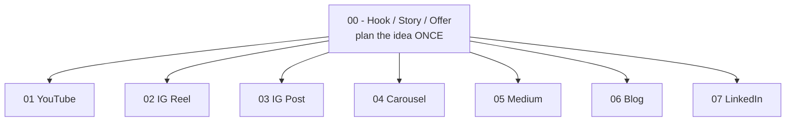

**The planning skeleton (from `00_Hook_Story_Offer_Planning.md`):**

```markdown
IDEA: __________________________________  (one sentence — if you can't, it's not ready)

HOOK   (stop the scroll in 3s — never a stat):  ____________________
STORY  (Problem -> Tension -> Turn -> Proof):   ____________________
OFFER  (exactly ONE ask):                       ____________________

SCREENSHOT LINE (the quotable truth): _______________________________
HONEST CAVEAT  (cuts against you):    _______________________________
```

Open `chapter_06_AI_Social_Media_Content_Creation/README.md` for the workflow, the universal voice rules, and the full template index.

---

## Chapter 07 — RAG (Retrieval-Augmented Generation)

**Concept:** **RAG Explorer** is a React + Express app that runs a full RAG pipeline end to end and *shows every stage*: a PDF is read, split into chunks, embedded with **Nomic Embed** (local Ollama), stored in a **local ChromaDB**, and — for each question — the top-k chunks are retrieved and handed to **Groq (`openai/gpt-oss-120b`)** to generate a grounded answer.

**Why:** RAG is usually a black box — you type a question and an answer appears. This app opens the box so a QA engineer can *see* the chunking, the actual embedding vectors, the similarity scores of retrieved chunks, and the exact augmented prompt sent to the LLM. Understanding each seam is what lets you test and debug a RAG system instead of trusting it blindly.

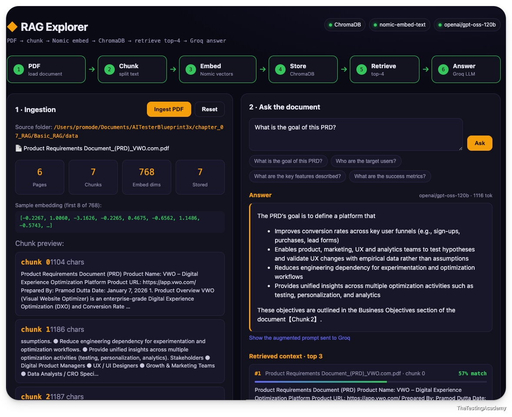

**Q&A — building a basic RAG pipeline:**
- **Q: Why a Node backend — can't this run in the browser?** A: No. The vector DB (ChromaDB), the embedder (Ollama), and PDF parsing are all server-side. The React UI only talks to the Express backend over same-origin `/api` (proxied by Vite).
- **Q: Why local Nomic Embed + local ChromaDB?** A: Zero cost, fully offline, and nothing leaves the machine. `nomic-embed-text` via Ollama produces 768-dim vectors; ChromaDB stores them and does cosine similarity search. Only the final answer step calls out (to Groq).
- **Q: How does retrieval actually work?** A: The question is embedded with the *same* model as the chunks, then ChromaDB returns the nearest `top-k` by cosine distance. Those chunks — and only those — become the LLM's context, so the answer is grounded in the document.

**The RAG flow:**

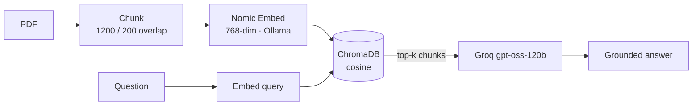

**The retrieval core (`server/lib/chroma.js`):**

```js
// Embed the query with the SAME model as the chunks, then pull top-k by cosine.
export async function retrieve(collection, queryText, k = 4) {
  const queryEmbedding = await embedQuery(queryText)          // Ollama nomic-embed-text
  const res = await collection.query({
    queryEmbeddings: [queryEmbedding],
    nResults: k,
    include: ['documents', 'metadatas', 'distances'],
  })
  return res.documents[0].map((text, i) => ({
    text,
    distance: res.distances[0][i],
    similarity: Math.max(0, 1 - res.distances[0][i]),         // cosine dist -> 0..1 for display
  }))
}
```

**Run it:**
```bash
cd chapter_07_RAG/Basic_RAG/rag-explorer
npm install
cp .env.example .env      # paste your GROQ_API_KEY
ollama pull nomic-embed-text
npm run dev               # starts ChromaDB + Express API + Vite UI
```

Open the Vite URL (default `http://localhost:5175`), click **Ingest folder** (or **upload your own** PDF / `.txt` / `.md`), then ask a question. Two tabs:

- **Explorer** — the pipeline view: ingestion stats, a sample embedding, retrieved chunks with similarity scores, and the augmented prompt sent to Groq.
- **Vector Store** — shows exactly what ChromaDB holds per chunk: each stored `id → 768-dim vector` rendered as a heatmap, plus its L2 norm / min / max and a raw-values view.

See `chapter_07_RAG/Basic_RAG/rag-explorer/README.md` for the full walkthrough and troubleshooting.

### Basic RAG in n8n (no-code)

`chapter_07_RAG/n8n_BASIC_RAG/AI3X_Basic_RAG.json` is the same RAG idea built as a **no-code n8n workflow** — the pipeline without writing a backend.

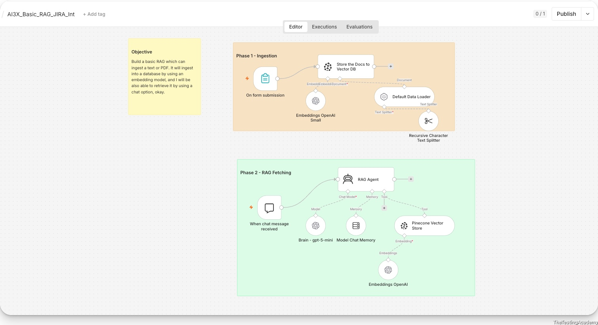

**Two phases:**
- **Phase 1 - Ingestion:** a form-submission trigger loads a text/PDF, a Recursive Character Text Splitter chunks it, OpenAI embeddings vectorise it, and the vectors land in a Pinecone vector store.
- **Phase 2 - RAG Fetching:** a chat-message trigger drives a RAG Agent (gpt-5-mini brain + chat memory) that retrieves from Pinecone (via OpenAI embeddings) and answers grounded in the ingested docs.

**Import + run:** open n8n, import `AI3X_Basic_RAG.json`, reconnect the OpenAI + Pinecone credentials, submit a document, then chat.

### RAG in LangFlow (visual)

`chapter_07_RAG/LangFlow_RAG/` builds the same retrieval idea on the LangFlow canvas, over a real QA dataset (`data/VWO_500_Test_Cases.csv` — 500 VWO test cases):

- `AI_3X_Naive RAG.json` — a naive RAG flow: load the CSV, embed, store, retrieve, answer.
- `AI_3X_Naive RAG_Imporve_Chunk.json` — the same flow with an **improved chunking** strategy, to show how chunk size/overlap changes retrieval quality.

**Why two flows:** chunking is the single biggest lever on RAG quality. Running a naive split next to a tuned one on the same 500-row dataset makes the difference visible — the retrieved rows get more relevant without touching the model.

**Import + run:** open LangFlow, import either JSON, reconnect your embedding + LLM credentials, and run the flow against the CSV.

### Advanced RAG — hybrid retrieval + reranking

`chapter_07_RAG/Advance_RAG/` upgrades Basic RAG into a production-shaped pipeline over **5,000 VWO test cases** (`testcase/vwo_5000_test_cases.csv`, Jira format). A Flask app with a two-pane UI shows every stage of a real hybrid pipeline.

**Concept:** `bge-m3` emits **dense + sparse** vectors from one model; **Qdrant** (embedded, no Docker) stores them; results are merged with **Reciprocal Rank Fusion**, re-scored by the **`bge-reranker-v2-m3`** cross-encoder, and answered by Groq — with **query rewriting** before retrieval.

**Why:** A single dense embedding + top-k misses exact IDs/keywords and ranks coarsely. Hybrid search + RRF + a cross-encoder reranker is what makes retrieval accurate on a real corpus, and the UI shows *why* an answer was grounded the way it was.

**Q&A — the advanced techniques:**
- **Q: What does the two-pane UI show?** A: Left = a live pipeline tracker (Read -> Build -> Chunk -> Embed -> Index, then Rewrite -> Dense -> Sparse -> RRF -> Rerank -> Generate). Right = Upload / Ingest (live SSE) / Chunks / Chat, with dense vs sparse vs fused vs reranked tables per query.
- **Q: Where do the models run?** A: `bge-m3` + the reranker run locally (downloaded once, ~2.3 GB + ~570 MB); only generation and query rewriting call out to Groq. Qdrant is an embedded file store.
- **Q: What's "Generate" mode?** A: A query like *"create a test case for VWO-3400 heatmap privacy masking"* auto-switches to producing a structured test case from the retrieved similar cases as templates.

**The pipeline:**

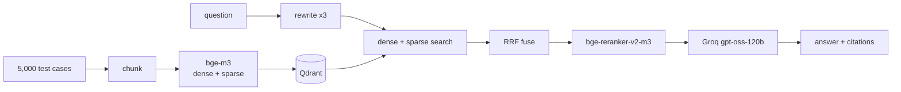

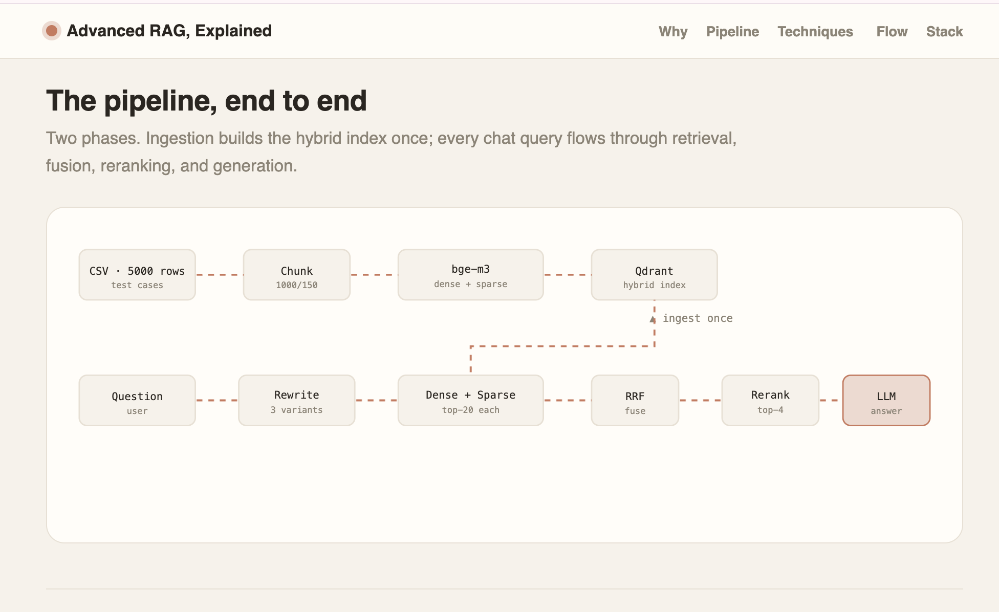

A standalone, animated **`Advanced_RAG_Explained.html`** teaches the whole concept (hybrid embeddings, RRF, reranking, rewriting) with diagrams — open it in any browser or upload it anywhere.

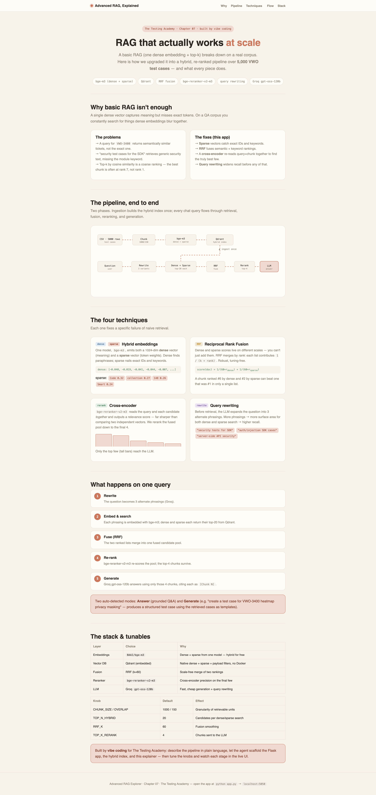

**Run it:**
```bash
cd chapter_07_RAG/Advance_RAG
python3 -m venv .venv && source .venv/bin/activate
pip install -r requirements.txt
cp .env.example .env      # paste your GROQ_API_KEY
python app.py             # http://127.0.0.1:5050
```

See `chapter_07_RAG/Advance_RAG/README.md` for the full walkthrough and tunables.

---

## End-to-End AI QA Pipeline (Blueprint)

**Concept:** `E2E_QA_Pipeline/` is the blueprint that ties the whole course together — an AI pipeline that reads a Jira story and drives it all the way to executed automation and an analysed results dashboard, with a RAG pipeline supplying historical test plans and cases along the way.

**Why:** Each chapter builds one capability (prompts, agents, RAG, automation). This document shows how they compose into a single autonomous loop: from a Jira story to test plan, test cases, Playwright automation, execution, and root-cause analysis — no manual step in between.

**Q&A — the end-to-end loop:**
- **Q: Where does RAG fit?** A: Steps 3 and 4. The agent generates the test plan and test cases by referencing a RAG store of past plans, cases, and testing docs — so output is context-aware and reusable, not generated from scratch.
- **Q: How do test cases become runnable?** A: Step 5 — a LangChain agent converts them into `.md` automation-flow files against the Playwright framework, which Browser Bash (step 6) executes with a cost-effective LLM (e.g. DeepSeek).
- **Q: What closes the loop?** A: Step 8 — `result.json` is fed back to an agent that checks flakiness, runs RCA, triages failures, and pushes the final data to a dashboard.

**The 8-step flow:**

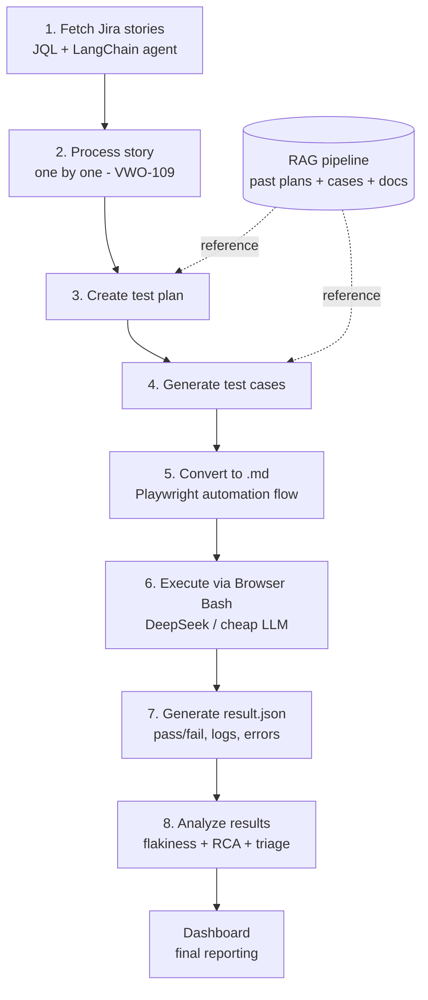

Read `E2E_QA_Pipeline/E2E_QA_Pipeline.md` for the full step-by-step write-up.

---

## Project - Job Tracker AI

`Project_Job_TRACKERAI/` is a local-first job application tracker built as a Vite + React single-page app. It stores every job card in the browser with IndexedDB through the `idb` library, so there is no backend, authentication, or external database.

**What's here:**
- Six Kanban columns: Wishlist, Applied, Follow-up, Interview, Offer, and Rejected.
- Drag-and-drop cards between columns with `@dnd-kit/core`.
- Add, edit, delete, search, and sort job cards.
- Resume-name reuse, LinkedIn job links, days-since-applied labels, salary notes, and status color accents.
- Light/dark mode plus JSON export/import for backups.

**Run it locally:**
```bash
cd Project_Job_TRACKERAI
npm install
npm run dev
```

Open the local Vite URL and use the app directly in the browser. Data persists in the browser's IndexedDB database named `job-tracker-ai`.

---

## How to Use This Repo

You can read it linearly (chapter 01 → 07) or jump straight to a project:

- **"I want better test cases now."** → `chapter_02_Prompt_Eng/templates/01_TestCaseGeneration_Prompt.md` or `02_TestCases_from_prd`.
- **"I want to write tests from a PDF/API doc."** → `chapter_02_Prompt_Eng/Project1_TC_Gen/`.
- **"I want to scaffold a Selenium project."** → `chapter_02_Prompt_Eng/Project2_Selenium_Framework/SKILL.md`, then run the Maven project under `AdvanceSeleniumFramework/`.
- **"I want my model to stop making things up."** → `chapter_02_Prompt_Eng/Anti_Hallucinations_Rules.md`.
- **"I want to generate a test plan from Jira."** → `chapter_03_BLAST_FW_JIRA_AI_AGENT/`.
- **"I want reusable QA automation agents."** → `chapter_04_AI_Agents_n8n/n8n_AIAgent/`.
- **"I want a local AI content dashboard."** → `chapter_04_AI_Agents_n8n/social_ai_agent/contentforge/`.
- **"I want publish-ready Testing Academy content."** → `chapter_04_AI_Agents_n8n/skillfile_content_generation/output/`.
- **"I want a scheduled social-post agent."** → `chapter_04_AI_Agents_n8n/n8n_AIAgent/AI_3X_05_Social_media_AI agent.json`.
- **"I want to tailor my resume to a job (ATS)."** → `chapter_04_AI_Agents_n8n/resume-tailor/SKILL.md`.
- **"I want to build AI agents visually (low-code)."** → `chapter_05_AI_Agents_LangFlow/`.
- **"I want to tell flaky tests from real failures."** → `chapter_05_AI_Agents_LangFlow/flaky_test_analyzer_ai_Agent/`.
- **"I want to validate an API response against a JSON schema."** → `chapter_05_AI_Agents_LangFlow/Project/AI3X_004_API_Contract_Validator.md`.
- **"I want to turn one idea into content for every platform."** → `chapter_06_AI_Social_Media_Content_Creation/` (start at `00_Hook_Story_Offer_Planning.md`).
- **"I want to publish a LinkedIn post that actually gets reach."** → `chapter_06_AI_Social_Media_Content_Creation/07_LinkedIn_Post_Template.md`.
- **"I want to see how a RAG pipeline works end to end."** → `chapter_07_RAG/Basic_RAG/rag-explorer/`.
- **"I want hybrid retrieval + reranking on a real 5,000-row corpus."** → `chapter_07_RAG/Advance_RAG/`.
- **"I want the big picture — Jira story to executed automation."** → `E2E_QA_Pipeline/E2E_QA_Pipeline.md`.
- **"I want to track job applications locally."** → `Project_Job_TRACKERAI/`.

## Requirements

- Any modern LLM (Claude / GPT / Gemini / DeepSeek). No specific provider required.
- For Project 2 only: **JDK 11+** and **Maven 3.9+** to compile and run the Selenium framework.
- For Chapter 3: **Node.js 18+**, npm, Jira API credentials, and a GROQ API key.
- For Chapter 4 n8n workflows: n8n Cloud or self-hosted n8n, plus credentials for whichever workflow nodes you enable.
- For Chapter 4 ContentForge: **Node.js 20+**, npm, `GROQ_API_KEY`, and `GEMINI_API_KEY`.
- For Chapter 4 Social Media Agent: n8n plus credentials for a chat model (DeepSeek / Gemini / OpenAI), Google Sheets, and Google Drive.
- For Chapter 5 LangFlow: a running LangFlow instance (default `http://localhost:7861`) and an OpenRouter (or compatible) API key; **Node.js 20+** and npm to run the Flaky Test Analyzer UI.
- For Chapter 6 Content Templates: nothing but a Markdown editor and any LLM — the templates are tooling-free.
- For Chapter 7 RAG Explorer: **Node.js 20+**, **Ollama** with `nomic-embed-text` pulled, **ChromaDB** (`pip install chromadb`), and a **Groq API key**.
- For Chapter 7 Advanced RAG: **Python 3.10+** and `pip install -r requirements.txt` (Flask, qdrant-client, FlagEmbedding/torch, pandas), plus a **Groq API key**. Models download on first use.
- For Job Tracker AI: **Node.js 20.19+ or 22.12+** and npm for Vite 8.

## Chapter History

`a2eb280` — chapter 01 LLM basics with interactive attention visualisations.
`dfe2653` — chapter 02 prompt engineering with RICE-POT framework + Selenium project.
`187a77f` — chapter 03 B.L.A.S.T. Jira to Test Plan generator.
`f67b4f6` — chapter 04 ContentForge local content pipeline + skill output pack.
`bbc77dc` — chapter 05 LangFlow Flaky Test Analyzer agent + React UI.
`e98d376` — chapter 05 API Contract Validator agent.
`d81aef0` — chapter 05 LangFlow agents (Hello World, Bug Triage) + chapter 04 skills.
`2d00d6f` — chapter 06 AI social media content templates + chapter 05 PROMPTS.md.

---

Made by [Pramod Dutta](https://thetestingacademy.com/) for The Testing Academy.
